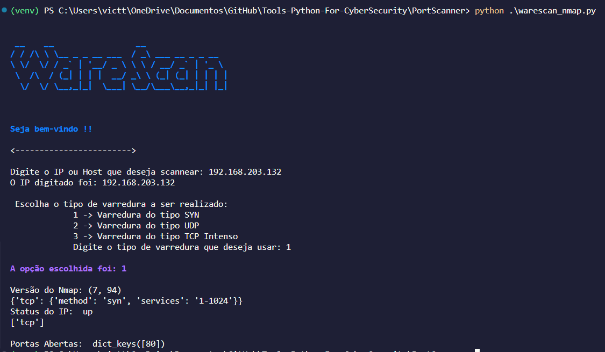

# Ware Scan 🐍

<p align="left">
	<a href="https://www.python.org/"></a>
	<a href="https://nmap.org/"></a>
</p>

- [Visão geral](#Visão geral)
- [Executando](#Executando)
- [Uso](#Uso)

# Visão geral
O scanner de portas é uma ferramenta da rede utilizada para realizar uma varredura de serviços em determinado IP ou Host. A ferramenta Nmap é a mais conhecida, por seus scanners personalizados e foco em vulnerabilidades. Aqui você encontrará três ferramentas que realizam a mesma coisa, mas caberá a você escolher a que mais se encaixa no seu contexto. Duas delas são integradas com o Nmap, a outra é mais simples utilizando apenas o socket.

# Executando

Executando o warescan.py:


Executando o warescan_nmap.py:


Executando o warescan_nmap_graphic.py:


# Uso 

Você pode usar no terminal o warescan.py:
```sh
python3 warescan.py
```
Ou o warescan_nmap.py:
```sh
python3 warescan_nmap.py
```
Ou o warescan_nmap_graphic.py:
```sh
python3 warescan_nmap_graphic.py
```

Todos possuem uma interface objetiva e de fácil compreensão, por isso não irei detalhar o uso interno, pois já fiz isso no código.