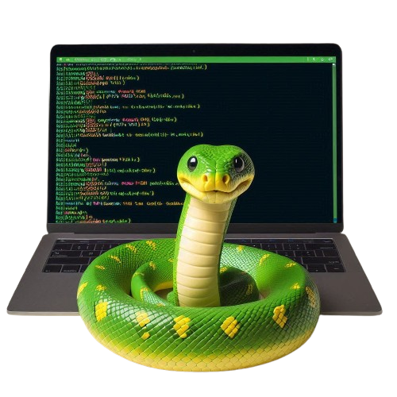

# OffensivePython

<p align="center">
    
</p>

## Sumário

* [Visão Geral](#visão-geral)
* [Conteúdos](#conteúdos)
* [Recursos](#recursos)
* [Requisitos](#requisitos)
* [Compilação](#compilação)
    * [Compilando o Projeto](#compilando-o-projeto)
    * [Adicionando Arquiteturas de Destino](#adicionando-arquiteturas-de-destino)
    * [Compilando para uma Arquitetura Específica](#compilando-para-uma-arquitetura-específica)
* [Como começar](#como-começar)
* [Contribuindo para o OffensivePython](#contribuindo-para-o-offensivepython)
* [Créditos / Referências / Agradecimentos / Motivação](#créditos--referências--agradecimentos--motivação)

## Visão Geral

OffensivePython é um repositório que abriga várias ferramentas e projetos relacionados a operações ofensivas de segurança, desenvolvidos em Python. Este repositório é dedicado a fornecer ferramentas eficazes e eficientes para profissionais de segurança e testadores de penetração que desejam realizar avaliações de segurança e testes de intrusão.

## Conteúdos

O repositório está organizado em vários projetos, cada um com seu próprio propósito e funcionalidade. Aqui estão alguns exemplos dos projetos incluídos:

1. [**Exploração de Vulnerabilidades**](/Exploracao_Vulnerabilidades)
   - Este projeto foca em técnicas de exploração para identificar e explorar vulnerabilidades em sistemas e aplicações.

2. [**Evasão de Análises**](/Evasao_Analises)
    - Técnicas para evitar a detecção durante análises de segurança e debugging.

3. [**Automação de Pentest**](/Automacao_Pentest)
    - Scripts e ferramentas para automatizar testes de penetração.

4. [**Ofuscação de Código**](/Ofuscacao_Codigo)
    - Técnicas para ofuscar o código, dificultando a análise reversa e a compreensão.

5. [**Exfiltração de Dados**](/Exfiltracao_Dados)
    - Métodos e ferramentas para exfiltração de dados de sistemas comprometidos.

## Recursos

- Ferramentas e scripts desenvolvidos em Python
- Técnicas modernas de ofensiva cibernética
- Exemplos práticos e código fonte para estudo

## Requisitos

Para utilizar as ferramentas deste repositório, você precisará ter o Python instalado em sua máquina. Além disso, é recomendável utilizar um ambiente virtual para gerenciar as dependências.

```sh
# Instale o Python (se ainda não estiver instalado)
sudo apt-get install python3

# Crie um ambiente virtual
python3 -m venv myenv

# Ative o ambiente virtual
source myenv/bin/activate

# Instale as dependências necessárias
pip install -r requirements.txt
```

## Compilação

### Compilando o Projeto

Para compilar o projeto, siga os passos abaixo:

```sh
git clone https://github.com/sousadevelop/OffensivePython.git
cd OffensivePython
python setup.py install
```

### Adicionando Arquiteturas de Destino
Para adicionar arquiteturas de destino, você pode modificar o arquivo de configuração ou usar comandos específicos para a sua plataforma.

### Compilando para uma Arquitetura Específica
Então, compile o projeto para a arquitetura específica:

```sh
python setup.py build --target=<arch>
```

## Como começar
Siga estes passos para começar a usar os projetos neste repositório:

1. Clone este repositório em sua máquina local:
   ```sh
   git clone https://github.com/sousadevelop/OffensivePython.git
   ```
2. Navegue até o diretório do projeto que você está interessado:
   ```sh
   cd OffensivePython/<nome-do-projeto>
   ```
3. Siga as instruções de instalação e uso específicas do projeto, conforme descrito no README dentro desse diretório.

## Contribuindo para o OffensivePython
Para contribuir com o OffensivePython, siga estes passos:

   1. Faça um fork deste repositório.
   2. Crie um branch: git checkout -b <nome-do-branch>.
   3. Faça suas alterações e confirme-as: git commit -m ' < mensagem-do-commit >'.
   4. Envie para o branch original: git push origin < nome-do-projeto > / < local >.
   5. Crie um pull request.
   
Alternativamente, consulte a documentação do GitHub sobre como criar um pull request.

## Créditos / Referências / Agradecimentos / Motivação
Eu gostaria expressar minha gratidão, primeiramente à Deus e segundo para as diversas pessoas que me ensinaram até aqui, desde cursos incríveis como os citados abaixo, como a amigos que tem me ajudado nessa trajetória de programação e pentest, dando-me inspiração para criar esse repositório que embora seja, simples, carrega todas as ideias facilitadoras que venho tendo.

  - Alguns cursos que me ajudaram foram das plataformas:
     - Dio.me
     - Desec Security
     - Cyph3r
     - Documentação de Libs usadas do Python
